# GoLinter

## Go AST

1. `*ast.Ident`是Go语言AST（Abstract Syntax Tree，抽象语法树）包中的一个结构体类型，表示**代码中的标识符（identifier），如变量名、函数名、类型名**等。

   这个结构体类型有如下几个重要的字段：

   - `Name`: 标识符的名称，是一个字符串类型的字面值。
   - `Obj`: 标识符的对象（Object），是一个指向一个对象的指针，这个对象可能是一个变量、常量、函数、类型等。
   - `Pos`: 标识符在源代码中的位置，是一个token.Pos类型的值。

   在Go语言的AST中，`*ast.Ident`类型经常出现在各种表达式中，例如变量声明、函数调用、运算符等等。通过使用这个结构体类型，我们可以方便地获取标识符的名称、位置等信息，从而进行语法分析和代码检查等操作。

2. `ast.Expr` 是一个表示 Go 语言中**所有表达式的接口类型**。它有**多个实现类型**，包括但不限于 `ast.BasicLit`（表示基本字面量），`ast.Ident`（表示标识符），`ast.SelectorExpr`（表示选择器表达式）等等。在 AST 中，许多节点都可能包含一个 `ast.Expr` 类型的表达式字段，因此该接口类型的实现类别是非常丰富的。

   在代码中，当我们需要处理一个表达式节点时，我们可以使用 `ast.Expr` 类型来表示它，这样就可以接收到**各种可能的表达式类型**了。例如，当我们处理一个函数调用时，其参数列表中的每个参数都是一个表达式，因此我们可以使用 `ast.Expr` 来表示它们。

3. `SelectorExpr`是Go语言AST中的一种节点类型，表示选择表达式，即对一个选择器的访问，例如`x.y`、`pkg.Type.Method`等。

   `SelectorExpr`有以下属性：

   - `X`：表示被选择的表达式，类型为`ast.Expr`，通常是一个标识符或一个字段访问表达式。
   - `Sel`：表示被选择的标识符，类型为`*ast.Ident`，表示被选择的标识符的名称。

   例如，对于表达式`foo.bar`，`foo`是`X`，`bar`是`Sel`。

[Golang的抽象语法树(AST) Step By Step - 知乎 (zhihu.com)](https://zhuanlan.zhihu.com/p/380421057)
https://toutiao.io/posts/fzt61t/preview

https://juejin.cn/post/7130188153792495630

WaitGroup：https://zhuanlan.zhihu.com/p/527193688

https://go101.org/article/concurrent-common-mistakes.html

Go AST结构：https://zhuanlan.zhihu.com/p/380421057，https://zhuanlan.zhihu.com/p/28516587

Go 断言：http://c.biancheng.net/view/4281.html

https://www.infoq.cn/article/n5k2unejil6cjtqghdvh

[https://draveness.me/golang/docs/part1-prerequisite/ch02-compile/golang-lexer-and-parser/#%E8%AF%8D%E6%B3%95%E5%88%86%E6%9E%90](https://draveness.me/golang/docs/part1-prerequisite/ch02-compile/golang-lexer-and-parser/#词法分析)

Goroutine leak and **fix** ：https://juejin.cn/post/7033711399041761311 

Data Race：https://zhuanlan.zhihu.com/p/532060939

Golangcli-lint https://blog.csdn.net/wohu1104/article/details/113751501

## ClosureError

Data Race：https://zhuanlan.zhihu.com/p/532060939

对于循环中每次被更新的变量，在for循环体中如果存在gostmt，且该变量被gostmt引用，则会出现goroutine的延迟绑定，不同goroutine可能拿到的变量是相同的变量值

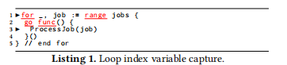

检测规则：

1. 检测范围在for循环体中
2. 确定for循环每次更新的变量(对于在block内更新的变量暂不考虑)
3. 确定for循环中是否存在gostmt
4. 确定更新的变量是否在gostmt中被引用，且不是通过参数传参的形式进行引用的

## pass_mutex_by_value

https://github.com/trailofbits/semgrep-rules/blob/main/go/sync-mutex-value-copied.yaml

https://go101.org/article/concurrent-common-mistakes.html

https://stackoverflow.com/questions/49808622/sync-mutex-and-sync-mutex-which-is-better

主要是锁在作为参数时，不能以值的方式进行传递，因为通常情况下锁是用来做并发控制，不同的线程是共享同一个锁，若通过值传递，会得到锁的副本，就不是同一把锁。

检测思路：

不要主动去检测参数是不是锁，是值还是引用，而是先去找锁使用的地方，再反过来去看是通过什么方式传递的。

传递锁的方式有两种，一种通过函数形参传递，另一个中通过函数接收器传递，锁可能是接收器或者接收器的属性，此时需要判断接收器是值形式还是引用形式。

## 开源扫描

目前的规则：

- **WaitGroupAdd**：Check if directly calling `$WG.add()` in anonymous goroutine
- **WaitGroupWaitInLoop**：Calling `$WG.Wait()` inside a loop blocks the call to `$WG.Done()`
- **HangingGoroutine**：Potential goroutine leak due to unbuffered channel send inside loop or unbuffered channel receive in select block
- **ClosureError**：Data race due to loop index variable capture
- **PassMutexByValue**：Pass or refer to a Mutex or a receiver containing a Mutex as a value type

|                 | WaitGroupAdd | WaitGroupWaitInLoop | HangingGoroutine | ClosureError | PassMutexByValue |
| :-------------: | :----------: | :-----------------: | :--------------: | :----------: | :--------------: |
|   **Grpc-go**   |              |                     |        2         |              |                  |
|     **K8S**     |              |                     |        11        |    1(FP)     |      1(FP)       |
| **go-ethereum** |              |                     |        6         |    2(FP)     |                  |
|     **Gin**     |              |                     |                  |              |                  |
|    **Hugo**     |              |          1          |        2         |              |      1(FP)       |

### Grpc-go

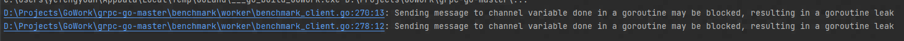

只扫出来两条，均为触发`HangGoroutine`规则，触发场景：

```go
//Ref：grpc-go-master/benchmark/worker/benchmark_client.go
1. go func(idx int) {
2. 	// TODO: do warm up if necessary.
3. 	// Now relying on worker client to reserve time to do warm up.
4. 	// The worker client needs to wait for some time after client is created,
5. 	// before starting benchmark.
6. 	done := make(chan bool)
7. 	for {
8. 		go func() {
9. 			start := time.Now()
10. 			if err := benchmark.DoUnaryCall(client, reqSize, respSize); err != nil {
11. 				select {
12. 				case <-bc.stop:
13. 				case done <- false: //blocked
14. 				}
15. 				return
16. 			}
17. 			elapse := time.Since(start)
18. 			bc.lockingHistograms[idx].add(int64(elapse))
19. 			select {
20. 			case <-bc.stop:
21. 			case done <- true: //blocked
22. 			}
23. 		}()
24. 		select {
25. 		case <-bc.stop: //在此返回
26. 			return
27. 		case <-done: //不再接收消息
28. 		}
29. 	}
30. }(idx)
```

### K8S

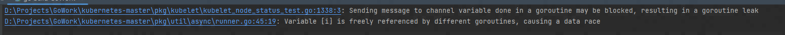

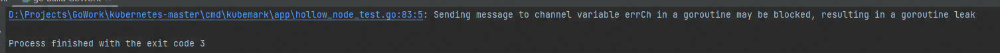

k8s-client-go:

大部分都是触发`HangingGoroutine`规则，触发的代码结构也基本相似，最后一个`PassMutexByValue`查看后属于FP，规则需要再细化

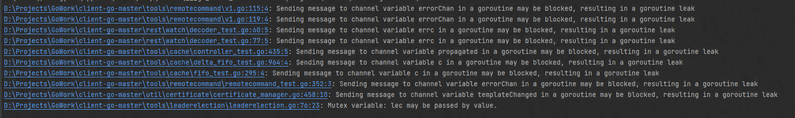

`HanglingGoroutine`:

```go
//Ref:kubernetes-master/pkg/kubelet/kubelet_node_status_test.go
1. 	done := make(chan struct{})
2. 	go func() {
3. 		kubelet.registerWithAPIServer()
4. 		done <- struct{}{} // may blocked
5. 	}()
6. 	select {
7. 	case <-time.After(wait.ForeverTestTimeout): //在此退出
8. 		assert.Fail(t, "timed out waiting for registration")
9. 	case <-done:
10. 		return
11. }
```

```go
//Ref: kubernetes-master/cmd/kubemark/app/hollow_node_test.go
1. errCh := make(chan error)
2. go func() {
3.      data, err := os.ReadFile(kubeconfigPath)
4. 		t.Logf("read %d, err=%v\n", len(data), err)
5. 		errCh <- run(s)
6. 	}()
7. 
8. select {
9. 	    case err := <-errCh:
10. 		t.Fatalf("Run finished unexpectedly with error: %v", err)
11. 	case <-time.After(3 * time.Second):
12. 		t.Logf("Morph %q hasn't crashed for 3s. Calling success.", morph)
13. }
```

`ClosureError`，误报，需要将gostmt后的类型限制在匿名函数中:

```go
//Ref: kubernetes-master/pkg/util/async/runner.go
1. // Start begins running.
2. func (r *Runner) Start() {
3. 	r.lock.Lock()
4. 	defer r.lock.Unlock()
5. 	if r.stop == nil {
6. 		c := make(chan struct{})
7. 		r.stop = &c
8. 		for i := range r.loopFuncs {
9. 			go r.loopFuncs[i](*r.stop)  //index i
10. 		}
11. 	}
12. }

// Runner is an abstraction to make it easy to start and stop groups of things that can be
// described by a single function which waits on a channel close to exit.
type Runner struct {
	lock      sync.Mutex
	loopFuncs []func(stop chan struct{})
	stop      *chan struct{}
}
```

### go-ethereum-master

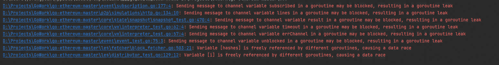

依旧是`HangingGoroutine`类型的较多：

存在误报，虽然符合规则，但是已经做了避免措施(发现学姐之前也扫出了这个。)：

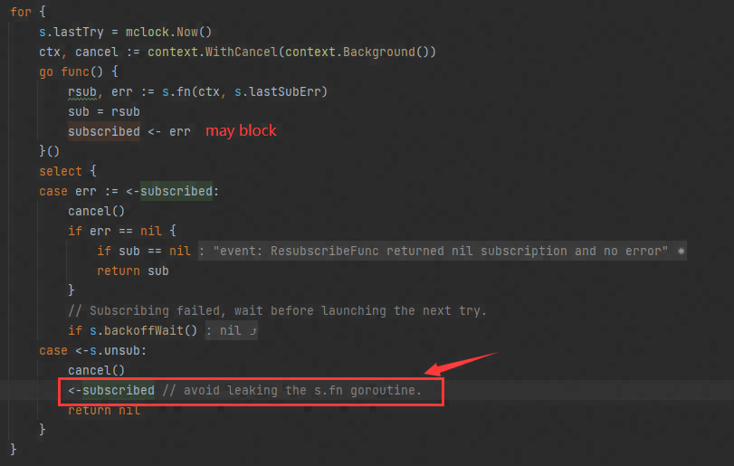

也有未做处理的：

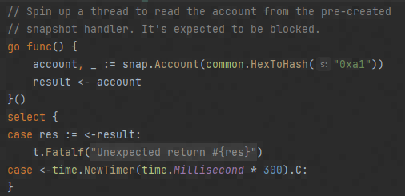

`ClosureError`类型的存在疑问，更典型的场景应该是循环变量在函数体内被捕获到，但这里i作为临时变量，也存在被引用捕获的可能(**需要再深入了解一下go起goroutine的底层逻辑**)：

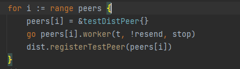

### Gin

无

### Hugo

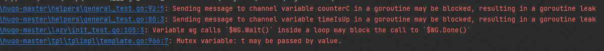

`HanglingGoroutine`：场景基本与前面的一致

`WaitGroupWaitInLoop`：

```go
//Ref: hugo-master/lazy/init_test.go
1		var wg sync.WaitGroup
2		ctx := context.Background()
3		// Add some concurrency and randomness to verify thread safety and
4		// init order.
5		for i := 0; i < 100; i++ {
6			wg.Add(1)
7			go func(i int) {
8				defer wg.Done()
9				var err error
10				if rnd.Intn(10) < 5 {
11					_, err = root.Do(ctx)
12					c.Assert(err, qt.IsNil)
13				}
14	
15				// Add a new branch on the fly.
16				if rnd.Intn(10) > 5 {
17					branch := branch1_2.Branch(f2())
18					_, err = branch.Do(ctx)
19					c.Assert(err, qt.IsNil)
20				} else {
21					_, err = branch1_2_1.Do(ctx)
22					c.Assert(err, qt.IsNil)
23				}
24				_, err = branch1_2.Do(ctx)
25				c.Assert(err, qt.IsNil)
26			}(i)
27			wg.Wait()
28			c.Assert(result, qt.Equals, "root(1)|root(2)|branch_1|branch_1_1|branch_1_2|branch_1_2_1|")
29	
30		}
```

`PassMutexByValue`: 业务逻辑上并没有问题，Clone到了另一份templateNamespace，两个struct用的同一把锁

**规则还要细化，针对 X.Y.Lock()的形式，X和Y都为非StarExpr时为错误？**

```go
//hugo-master/tpl/tplimpl/template.go
1	type templateStateMap struct {
2		mu        sync.RWMutex
3		templates map[string]*templateState
4	}
5	
6	type templateNamespace struct {
7		prototypeText      *texttemplate.Template
8		prototypeHTML      *htmltemplate.Template
9		prototypeTextClone *texttemplate.Template
10		prototypeHTMLClone *htmltemplate.Template
11	
12		*templateStateMap //是个指针
13	}
14	
15	func (t templateNamespace) Clone() *templateNamespace {
16		t.mu.Lock()
17		defer t.mu.Unlock()
18	
19		t.templateStateMap = &templateStateMap{
20			templates: make(map[string]*templateState),
21		}
22	
23		t.prototypeText = texttemplate.Must(t.prototypeText.Clone())
24		t.prototypeHTML = htmltemplate.Must(t.prototypeHTML.Clone())
25	
26		return &t
27	}
```

## 遇到的问题

1. 对目标路径进行扫描时，会先对目标项目进行编译，在go build时可能报出undefined的错误，但是实际文件中并没有报错，可能是涉及到go 和 c的交叉编译：https://juejin.cn/post/7168747781388140580，https://blog.51cto.com/huashao/5197911

   在Goland的启动配置的`Environment`中添加：`CGO_ENABLED=1;CC=x86_64-w64-mingw32-gcc;GOARCH=amd64;GOOS=windows;CGO_LDFLAGS="-static"`

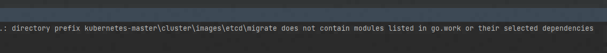

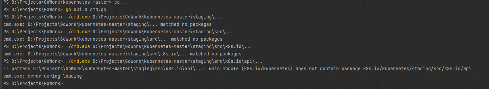
